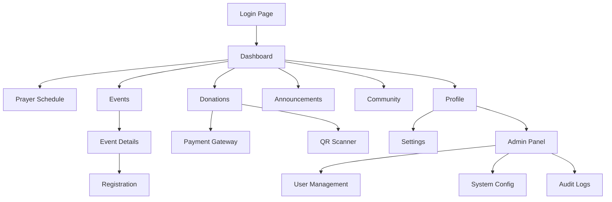

# Masjeed - Masjid Management PWA
## Product Requirements Document

## 1. Product Overview
Masjeed is a comprehensive Progressive Web Application (PWA) designed to modernize mosque management and enhance community engagement. The platform serves as a digital hub for mosque administration, prayer schedules, events, donations, and community communication.

The application addresses the need for efficient mosque operations while fostering stronger community connections through digital tools. It targets mosque administrators, religious leaders, and congregation members who seek streamlined management and enhanced spiritual community experience.

The product aims to become the leading digital solution for mosque management, potentially serving thousands of mosques globally with localized features and scalable architecture.

## 2. Core Features

### 2.1 User Roles
| Role | Registration Method | Core Permissions |
|------|---------------------|------------------|
| Jamaah (Congregation) | Google OAuth registration | View prayer schedules, events, announcements; make donations; access community directory |
| Pengurus (Committee) | Admin invitation + Google OAuth | Manage events, create announcements, view donation reports, moderate community content |
| Imam (Religious Leader) | Admin assignment + Google OAuth | Manage prayer schedules, create religious content, oversee events, access congregation insights |
| Admin (Administrator) | System setup + Google OAuth | Full system access, user management, financial oversight, system configuration |

### 2.2 Feature Module
Our Masjeed PWA consists of the following main pages:
1. **Dashboard**: Role-based home screen, quick actions, prayer times widget, recent announcements
2. **Prayer Schedule**: Daily/weekly/Ramadan prayer times, Qibla direction, Islamic calendar integration
3. **Events Management**: Kajian (study sessions), Jumat (Friday prayers), Pengajian (religious gatherings) scheduling and registration
4. **Donation & Zakat**: Digital payment processing, QR code donations, zakat calculator, financial transparency reports
5. **Announcements**: Community notices, urgent alerts, categorized messaging system
6. **Community Directory**: Member profiles, contact information, skill sharing, volunteer coordination
7. **Profile & Settings**: User preferences, notification settings, language selection, theme toggle
8. **Admin Panel**: User management, system configuration, audit logs, analytics dashboard

### 2.3 Page Details
| Page Name | Module Name | Feature description |
|-----------|-------------|---------------------|
| Dashboard | Prayer Widget | Display current and next prayer times with countdown timer, Qibla compass |
| Dashboard | Quick Actions | Role-based action buttons for common tasks (donate, register event, create announcement) |
| Dashboard | Recent Updates | Latest announcements, upcoming events, donation goals progress |
| Prayer Schedule | Daily Schedule | Show 5 daily prayers with accurate times based on location, Hijri date display |
| Prayer Schedule | Weekly View | 7-day prayer schedule overview with special events highlighted |
| Prayer Schedule | Ramadan Mode | Special Ramadan schedule with Suhur/Iftar times, Tarawih prayers |
| Events Management | Event Creation | Create kajian/jumat/pengajian with date, time, speaker, capacity, registration |
| Events Management | Registration System | Allow users to register for events, manage attendance, send reminders |
| Events Management | Event Calendar | Monthly/weekly calendar view of all mosque events |
| Donation & Zakat | Payment Processing | Secure donation processing with multiple payment methods |
| Donation & Zakat | QR Code Generator | Generate QR codes for quick donations, display at mosque entrances |
| Donation & Zakat | Zakat Calculator | Calculate zakat obligations based on assets, provide payment options |
| Donation & Zakat | Financial Reports | Transparent reporting of donations received and mosque expenses |
| Announcements | Message Creation | Create categorized announcements with priority levels, rich text editor |
| Announcements | Push Notifications | Send real-time notifications to app users based on preferences |
| Announcements | Archive System | Searchable archive of past announcements with filtering options |
| Community Directory | Member Profiles | Display member information, skills, volunteer interests (privacy-controlled) |
| Community Directory | Contact Management | Secure contact sharing, emergency contact system |
| Community Directory | Volunteer Coordination | Match volunteers with mosque needs, track volunteer hours |
| Profile & Settings | Account Management | Update personal information, manage privacy settings |
| Profile & Settings | Preferences | Configure notification preferences, prayer reminders, language selection |
| Profile & Settings | Theme & Display | Toggle dark/light mode, adjust font sizes, accessibility options |
| Admin Panel | User Management | Add/remove users, assign roles, manage permissions, view user activity |
| Admin Panel | System Configuration | Configure mosque details, prayer time settings, payment gateways |
| Admin Panel | Audit Logs | Track system changes, user actions, security events |
| Admin Panel | Analytics Dashboard | View usage statistics, donation trends, event attendance metrics |

## 3. Core Process

**Jamaah (Congregation Member) Flow:**
Users register via Google OAuth, access dashboard with prayer times and announcements, register for events, make donations via QR codes or digital payments, and interact with community directory.

**Pengurus (Committee Member) Flow:**
Committee members receive admin invitation, manage events and announcements, monitor donation campaigns, moderate community content, and generate reports for mosque leadership.

**Imam Flow:**
Imams manage prayer schedules and religious content, oversee event planning, access congregation insights for better community service, and coordinate with committee members.

**Admin Flow:**
Administrators configure system settings, manage all user roles, oversee financial operations, monitor system security through audit logs, and analyze usage patterns for optimization.

## 4. User Interface Design
### 4.1 Design Style
- **Primary Colors**: Islamic Green (#2E7D32) and Gold (#FFB300) for spiritual and welcoming feel
- **Secondary Colors**: Soft Blue (#1976D2) for trust, Warm Gray (#757575) for text
- **Button Style**: Rounded corners with subtle shadows, gradient backgrounds for primary actions
- **Typography**: Roboto for Latin text, Amiri for Arabic text, 16px base size for accessibility
- **Layout Style**: Card-based design with clean spacing, top navigation with bottom tab bar for mobile
- **Icons**: Material Design icons with Islamic-themed custom icons for prayer, mosque, and religious elements
- **Animations**: Smooth transitions, prayer time countdown animations, subtle loading states

### 4.2 Page Design Overview
| Page Name | Module Name | UI Elements |
|-----------|-------------|-------------|
| Dashboard | Prayer Widget | Large card with current prayer time, countdown timer, green accent colors, Qibla compass icon |
| Dashboard | Quick Actions | Grid of rounded action buttons with icons, gradient backgrounds, shadow effects |
| Prayer Schedule | Daily View | Clean table layout, time highlighting, Islamic calendar integration, location-based accuracy |
| Events | Event Cards | Image thumbnails, speaker photos, registration buttons, capacity indicators, date badges |
| Donations | Payment Form | Secure input fields, amount presets, QR code display, progress bars for campaigns |
| Announcements | Message List | Priority color coding, read/unread states, expandable content, timestamp display |
| Community | Member Grid | Profile photos, skill tags, contact buttons, privacy indicators, search functionality |
| Admin Panel | Management Tables | Data tables with sorting, filtering, action buttons, status indicators, export options |

### 4.3 Responsiveness
The application follows a mobile-first approach with responsive design adapting to desktop, tablet, and mobile devices. Touch interactions are optimized for mobile use with appropriate button sizes and gesture support. The PWA includes install prompts and offline functionality for enhanced mobile experience.

## 5. Technical Requirements

### 5.1 Security & Privacy
- **PII Protection**: Encrypt sensitive personal information, implement data minimization principles
- **Input Sanitization**: Validate and sanitize all user inputs to prevent XSS and injection attacks
- **Role-based Guards**: Implement strict access controls based on user roles and permissions
- **Session Security**: Use secure HTTP-only cookies for session management with proper expiration

### 5.2 Performance & Offline
- **Service Worker**: Implement comprehensive caching strategy for offline functionality
- **Push Notifications**: Real-time notifications for announcements and prayer reminders
- **Install Prompt**: Native app-like installation experience across devices
- **Caching Strategy**: Cache prayer schedules, announcements, and essential app data

### 5.3 Internationalization
- **Languages**: Support Indonesian (ID) and English (EN) with RTL consideration for Arabic text
- **Cultural Adaptation**: Islamic calendar, local prayer time calculations, cultural color preferences
- **Content Localization**: All UI text, error messages, and notifications in both languages

### 5.4 Future Modularity
- **IoT Integration**: Prepare architecture for automated adzan (call to prayer) systems
- **Inventory Management**: Modular structure for mosque asset and resource management
- **Classroom Management**: Framework for Islamic education and class scheduling modules
- **API Extensibility**: RESTful API design allowing third-party integrations and mobile apps