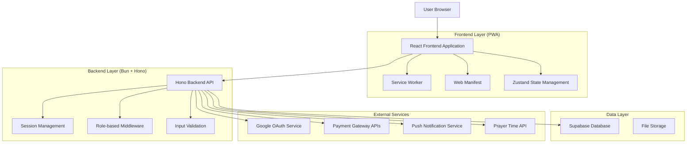
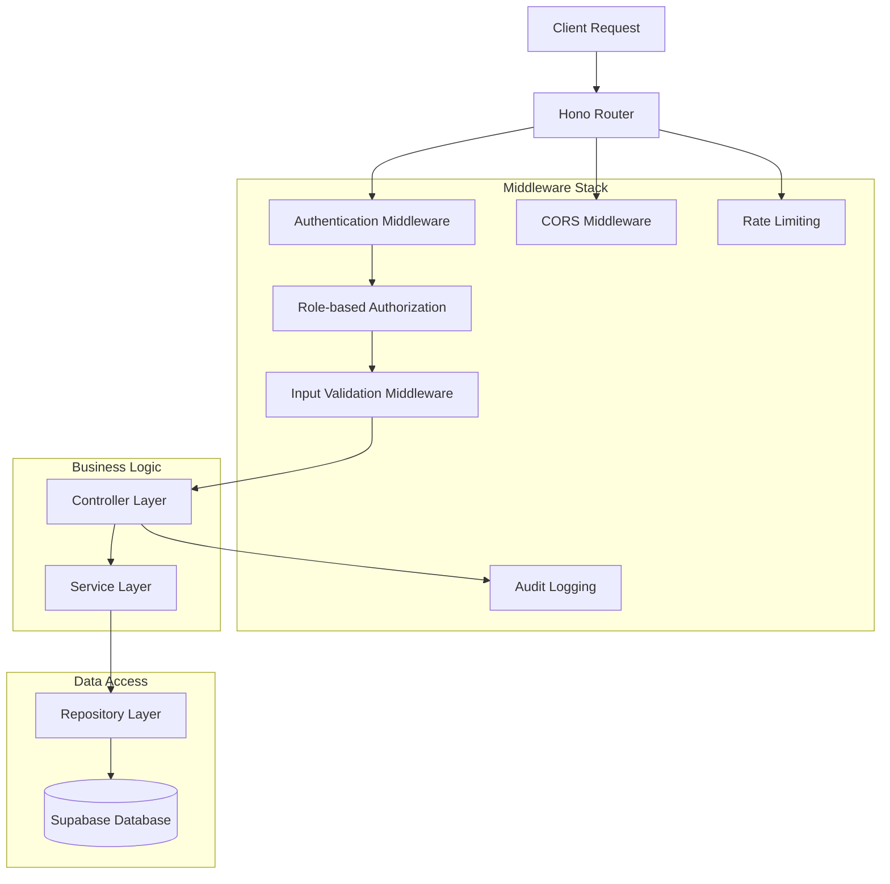
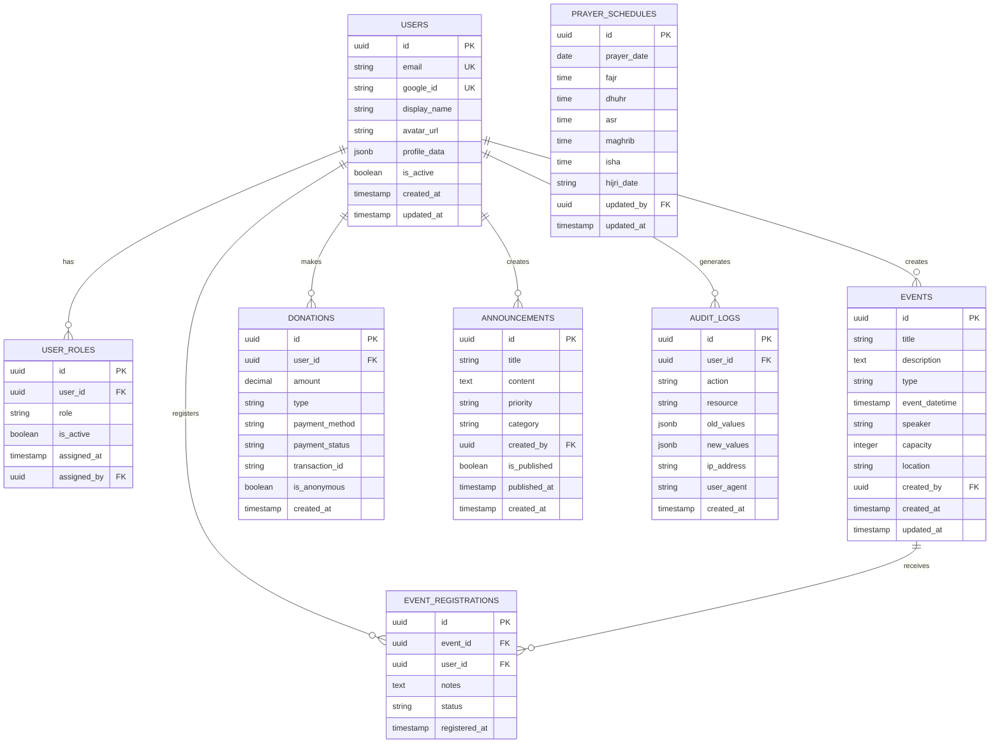

# Masjeed - Technical Architecture Document

## 1. Architecture Design



## 2. Technology Description

- **Frontend**: React@18 + Vite@5 + TypeScript + Tailwind CSS + Zustand + React Query
- **Backend**: Bun@1.0 + Hono@3.0 + TypeScript
- **Database**: Supabase (PostgreSQL) with Row Level Security
- **Authentication**: Google OAuth 2.0 + Supabase Auth
- **PWA**: Service Worker + Web Manifest + Workbox
- **State Management**: Zustand for client state, React Query for server state
- **Styling**: Tailwind CSS + Headless UI components
- **Testing**: Vitest + React Testing Library + Playwright
- **Deployment**: Vercel (Frontend) + Railway/Fly.io (Backend)

## 3. Route Definitions

| Route | Purpose |
|-------|----------|
| / | Landing page with mosque information and login |
| /dashboard | Role-based dashboard with prayer times and quick actions |
| /login | Google OAuth authentication page |
| /prayers | Prayer schedule management (daily/weekly/Ramadan) |
| /events | Event listing, creation, and management |
| /events/:id | Individual event details and registration |
| /donations | Donation interface with QR codes and payment options |
| /announcements | Community announcements and notifications |
| /community | Member directory and volunteer coordination |
| /profile | User profile and account settings |
| /admin | Admin panel for system management (Admin only) |
| /admin/users | User management interface (Admin only) |
| /admin/audit | System audit logs (Admin only) |
| /offline | Offline fallback page with cached content |

## 4. API Definitions

### 4.1 Authentication APIs

**Google OAuth Login**
```
GET /api/auth/google
```
Redirects to Google OAuth consent screen

**OAuth Callback**
```
POST /api/auth/callback
```
Request:
| Param Name | Param Type | isRequired | Description |
|------------|------------|------------|-------------|
| code | string | true | OAuth authorization code |
| state | string | true | CSRF protection state |

Response:
| Param Name | Param Type | Description |
|------------|------------|-------------|
| success | boolean | Authentication status |
| user | UserProfile | User information |
| role | string | User role (Admin/Imam/Pengurus/Jamaah) |

**Logout**
```
POST /api/auth/logout
```
Clears session cookies and invalidates tokens

### 4.2 Prayer Schedule APIs

**Get Prayer Times**
```
GET /api/prayers?date={date}&type={daily|weekly|ramadan}
```
Response:
| Param Name | Param Type | Description |
|------------|------------|-------------|
| prayers | PrayerTime[] | Array of prayer times |
| hijriDate | string | Islamic calendar date |
| qiblaDirection | number | Qibla direction in degrees |

**Update Prayer Times (Imam/Admin)**
```
PUT /api/prayers
```
Request:
| Param Name | Param Type | isRequired | Description |
|------------|------------|------------|-------------|
| date | string | true | Date in ISO format |
| fajr | string | true | Fajr prayer time |
| dhuhr | string | true | Dhuhr prayer time |
| asr | string | true | Asr prayer time |
| maghrib | string | true | Maghrib prayer time |
| isha | string | true | Isha prayer time |

### 4.3 Events APIs

**Get Events**
```
GET /api/events?type={kajian|jumat|pengajian}&month={month}
```
Response:
| Param Name | Param Type | Description |
|------------|------------|-------------|
| events | Event[] | Array of events |
| totalCount | number | Total number of events |

**Create Event (Pengurus/Imam/Admin)**
```
POST /api/events
```
Request:
| Param Name | Param Type | isRequired | Description |
|------------|------------|------------|-------------|
| title | string | true | Event title |
| description | string | true | Event description |
| type | string | true | Event type (kajian/jumat/pengajian) |
| dateTime | string | true | Event date and time |
| speaker | string | false | Speaker name |
| capacity | number | false | Maximum attendees |
| location | string | true | Event location |

**Register for Event**
```
POST /api/events/:id/register
```
Request:
| Param Name | Param Type | isRequired | Description |
|------------|------------|------------|-------------|
| notes | string | false | Registration notes |

### 4.4 Donation APIs

**Create Donation**
```
POST /api/donations
```
Request:
| Param Name | Param Type | isRequired | Description |
|------------|------------|------------|-------------|
| amount | number | true | Donation amount |
| type | string | true | Donation type (general/zakat/sadaqah) |
| isAnonymous | boolean | false | Anonymous donation flag |
| paymentMethod | string | true | Payment method |

**Generate QR Code**
```
GET /api/donations/qr?amount={amount}&type={type}
```
Response:
| Param Name | Param Type | Description |
|------------|------------|-------------|
| qrCode | string | Base64 encoded QR code image |
| paymentUrl | string | Payment URL |

### 4.5 Community APIs

**Get Community Members**
```
GET /api/community?search={query}&skills={skills}
```
Response:
| Param Name | Param Type | Description |
|------------|------------|-------------|
| members | CommunityMember[] | Array of community members |
| totalCount | number | Total number of members |

**Update Profile**
```
PUT /api/profile
```
Request:
| Param Name | Param Type | isRequired | Description |
|------------|------------|------------|-------------|
| displayName | string | false | Display name |
| bio | string | false | User biography |
| skills | string[] | false | User skills |
| isPublic | boolean | false | Profile visibility |

## 5. Server Architecture Diagram



## 6. Data Model

### 6.1 Data Model Definition



### 6.2 Data Definition Language

**Users Table**
```sql
-- Create users table
CREATE TABLE users (
    id UUID PRIMARY KEY DEFAULT gen_random_uuid(),
    email VARCHAR(255) UNIQUE NOT NULL,
    google_id VARCHAR(255) UNIQUE NOT NULL,
    display_name VARCHAR(100) NOT NULL,
    avatar_url TEXT,
    profile_data JSONB DEFAULT '{}',
    is_active BOOLEAN DEFAULT true,
    created_at TIMESTAMP WITH TIME ZONE DEFAULT NOW(),
    updated_at TIMESTAMP WITH TIME ZONE DEFAULT NOW()
);

-- Create indexes
CREATE INDEX idx_users_email ON users(email);
CREATE INDEX idx_users_google_id ON users(google_id);
CREATE INDEX idx_users_active ON users(is_active);

-- Row Level Security
ALTER TABLE users ENABLE ROW LEVEL SECURITY;

-- Policies
CREATE POLICY "Users can view their own profile" ON users
    FOR SELECT USING (auth.uid() = id);

CREATE POLICY "Users can update their own profile" ON users
    FOR UPDATE USING (auth.uid() = id);

-- Grant permissions
GRANT SELECT ON users TO anon;
GRANT ALL PRIVILEGES ON users TO authenticated;
```

**User Roles Table**
```sql
-- Create user_roles table
CREATE TABLE user_roles (
    id UUID PRIMARY KEY DEFAULT gen_random_uuid(),
    user_id UUID REFERENCES users(id) ON DELETE CASCADE,
    role VARCHAR(20) NOT NULL CHECK (role IN ('Admin', 'Imam', 'Pengurus', 'Jamaah')),
    is_active BOOLEAN DEFAULT true,
    assigned_at TIMESTAMP WITH TIME ZONE DEFAULT NOW(),
    assigned_by UUID REFERENCES users(id)
);

-- Create indexes
CREATE INDEX idx_user_roles_user_id ON user_roles(user_id);
CREATE INDEX idx_user_roles_role ON user_roles(role);
CREATE INDEX idx_user_roles_active ON user_roles(is_active);

-- Row Level Security
ALTER TABLE user_roles ENABLE ROW LEVEL SECURITY;

-- Policies
CREATE POLICY "Users can view their own roles" ON user_roles
    FOR SELECT USING (auth.uid() = user_id);

-- Grant permissions
GRANT SELECT ON user_roles TO authenticated;
GRANT ALL PRIVILEGES ON user_roles TO authenticated;
```

**Events Table**
```sql
-- Create events table
CREATE TABLE events (
    id UUID PRIMARY KEY DEFAULT gen_random_uuid(),
    title VARCHAR(200) NOT NULL,
    description TEXT NOT NULL,
    type VARCHAR(20) NOT NULL CHECK (type IN ('kajian', 'jumat', 'pengajian')),
    event_datetime TIMESTAMP WITH TIME ZONE NOT NULL,
    speaker VARCHAR(100),
    capacity INTEGER,
    location VARCHAR(200) NOT NULL,
    created_by UUID REFERENCES users(id) NOT NULL,
    created_at TIMESTAMP WITH TIME ZONE DEFAULT NOW(),
    updated_at TIMESTAMP WITH TIME ZONE DEFAULT NOW()
);

-- Create indexes
CREATE INDEX idx_events_type ON events(type);
CREATE INDEX idx_events_datetime ON events(event_datetime);
CREATE INDEX idx_events_created_by ON events(created_by);

-- Row Level Security
ALTER TABLE events ENABLE ROW LEVEL SECURITY;

-- Policies
CREATE POLICY "Everyone can view events" ON events
    FOR SELECT USING (true);

CREATE POLICY "Authorized users can create events" ON events
    FOR INSERT WITH CHECK (
        EXISTS (
            SELECT 1 FROM user_roles 
            WHERE user_id = auth.uid() 
            AND role IN ('Admin', 'Imam', 'Pengurus')
            AND is_active = true
        )
    );

-- Grant permissions
GRANT SELECT ON events TO anon;
GRANT ALL PRIVILEGES ON events TO authenticated;
```

**Donations Table**
```sql
-- Create donations table
CREATE TABLE donations (
    id UUID PRIMARY KEY DEFAULT gen_random_uuid(),
    user_id UUID REFERENCES users(id),
    amount DECIMAL(10,2) NOT NULL CHECK (amount > 0),
    type VARCHAR(20) NOT NULL CHECK (type IN ('general', 'zakat', 'sadaqah')),
    payment_method VARCHAR(50) NOT NULL,
    payment_status VARCHAR(20) DEFAULT 'pending' CHECK (payment_status IN ('pending', 'completed', 'failed', 'refunded')),
    transaction_id VARCHAR(100),
    is_anonymous BOOLEAN DEFAULT false,
    created_at TIMESTAMP WITH TIME ZONE DEFAULT NOW()
);

-- Create indexes
CREATE INDEX idx_donations_user_id ON donations(user_id);
CREATE INDEX idx_donations_type ON donations(type);
CREATE INDEX idx_donations_status ON donations(payment_status);
CREATE INDEX idx_donations_created_at ON donations(created_at DESC);

-- Row Level Security
ALTER TABLE donations ENABLE ROW LEVEL SECURITY;

-- Policies
CREATE POLICY "Users can view their own donations" ON donations
    FOR SELECT USING (auth.uid() = user_id OR is_anonymous = false);

-- Grant permissions
GRANT SELECT ON donations TO authenticated;
GRANT ALL PRIVILEGES ON donations TO authenticated;
```

**Prayer Schedules Table**
```sql
-- Create prayer_schedules table
CREATE TABLE prayer_schedules (
    id UUID PRIMARY KEY DEFAULT gen_random_uuid(),
    prayer_date DATE NOT NULL UNIQUE,
    fajr TIME NOT NULL,
    dhuhr TIME NOT NULL,
    asr TIME NOT NULL,
    maghrib TIME NOT NULL,
    isha TIME NOT NULL,
    hijri_date VARCHAR(20),
    updated_by UUID REFERENCES users(id),
    updated_at TIMESTAMP WITH TIME ZONE DEFAULT NOW()
);

-- Create indexes
CREATE INDEX idx_prayer_schedules_date ON prayer_schedules(prayer_date);
CREATE INDEX idx_prayer_schedules_updated_by ON prayer_schedules(updated_by);

-- Row Level Security
ALTER TABLE prayer_schedules ENABLE ROW LEVEL SECURITY;

-- Policies
CREATE POLICY "Everyone can view prayer schedules" ON prayer_schedules
    FOR SELECT USING (true);

CREATE POLICY "Authorized users can manage prayer schedules" ON prayer_schedules
    FOR ALL USING (
        EXISTS (
            SELECT 1 FROM user_roles 
            WHERE user_id = auth.uid() 
            AND role IN ('Admin', 'Imam')
            AND is_active = true
        )
    );

-- Grant permissions
GRANT SELECT ON prayer_schedules TO anon;
GRANT ALL PRIVILEGES ON prayer_schedules TO authenticated;
```

**Initial Data**
```sql
-- Insert default admin user (to be updated with actual Google OAuth data)
INSERT INTO users (email, google_id, display_name) 
VALUES ('admin@masjeed.app', 'temp_google_id', 'System Administrator');

-- Insert default user role
INSERT INTO user_roles (user_id, role) 
SELECT id, 'Admin' FROM users WHERE email = 'admin@masjeed.app';

-- Insert sample prayer schedule for current month
INSERT INTO prayer_schedules (prayer_date, fajr, dhuhr, asr, maghrib, isha, hijri_date)
VALUES 
    (CURRENT_DATE, '05:30', '12:15', '15:45', '18:30', '19:45', '1 Muharram 1446'),
    (CURRENT_DATE + 1, '05:31', '12:15', '15:45', '18:29', '19:44', '2 Muharram 1446');
```